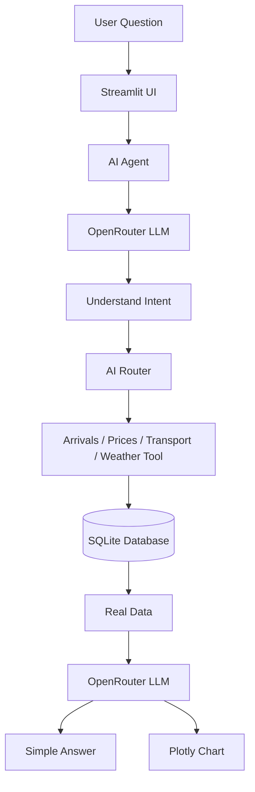
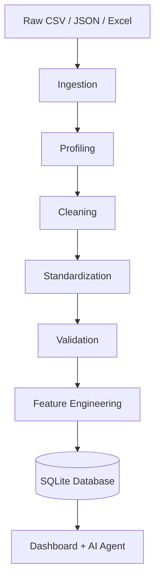
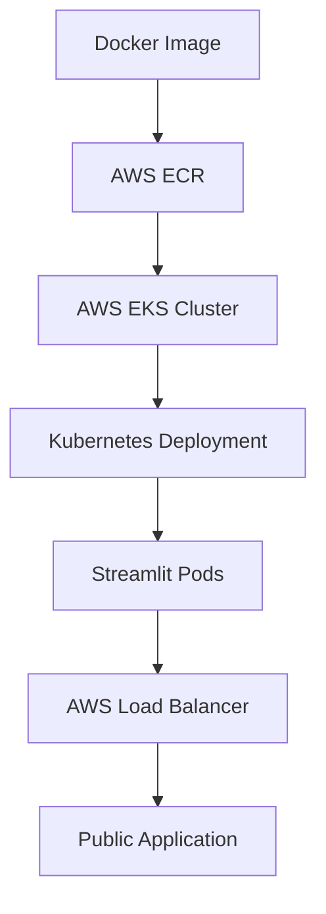

# 🌾 Mandi-to-Market Supply Chain Optimizer

A data-driven **AgriTech platform** that cleans mandi and supply-chain data, stores it in SQLite, provides analytics through Streamlit, and lets users ask agricultural questions using an **AI Assistant**.

Built for **TransOrg AgentIQ Datathon — Track 3: AgriTech**.

---

## Live Demo

[Live Application Link](http://ae65172f6181b40eaa68183327ce2efe-1222467219.eu-north-1.elb.amazonaws.com)

---

##  What It Does

*  Mandi arrivals and price analysis
*  Price vs MSP monitoring
*  Weather impact analysis
*  Transport and supply-chain analysis
*  Risk, forecasts, and anomaly detection
*  Natural-language AI Agricultural Assistant
*  Interactive Plotly visualizations
*  Docker + AWS ECR + AWS EKS deployment

---

##  AI Assistant

Users can ask questions in natural language:

```text
Which mandis have the highest wheat arrivals?
Which mandis have wheat prices below MSP?
What is the average rainfall and temperature?
Show me the transport delays.
```

### AI Architecture Flow



> The LLM understands and explains the query; actual agricultural values are retrieved deterministically from the SQLite database.

---

##  Data Pipeline

### Processing Flow



### Handled Edge Cases

* Different crop names and alternate spellings
* English/Hindi bilingual naming variants
* Inconsistent measurement units
* Mixed date formats
* Time-zone offsets
* Missing values
* Duplicate records

---

##  Project Structure

```text
mandi-to-market-optimizer/
├── agent/              # AI Agricultural Assistant
├── dashboard/          # Streamlit dashboard
├── data/
│   ├── raw/            # Source datasets
│   └── processed/      # SQLite database
├── docs/               # Documentation
├── k8s/                # Kubernetes configuration
├── notebooks/          # Data analysis
├── scripts/            # Utility scripts
├── sql/                # Database SQL
├── src/                # Data pipeline & analytics
├── tests/              # Tests
├── Dockerfile          # Docker configuration
├── requirements.txt    # Python dependencies
└── README.md
```

---

##  Database

* **File:** `data/processed/mandi_market.db`
* **Core Schemas:**
  * Mandi Arrivals
  * Crop Prices
  * MSP (Minimum Support Price)
  * Weather
  * Transport & Logistics

---

##  Tech Stack

| Category | Technologies |
| :--- | :--- |
| **Core & Processing** | Python, Pandas, NumPy, Scikit-learn, Statsmodels |
| **Storage & UI** | SQLite, Streamlit, Plotly |
| **GenAI** | OpenRouter API, Tool Calling Agent |
| **Cloud & DevOps** | Docker, Kubernetes, AWS ECR, AWS EKS |
| **Quality Assurance** | Pytest |

---

##  Local Setup

```bash
python -m venv venv
venv\Scripts\activate
pip install -r requirements.txt
python -m src.pipeline
streamlit run dashboard/app.py
```

Set the required environment variable for AI features:

```bash
export OPENROUTER_API_KEY="your_api_key_here"
```

> Do not commit or hardcode API keys into source control.

---

##  Docker

```bash
docker build -t mandi-to-market-optimizer .
docker run -p 8501:8501 mandi-to-market-optimizer
```

---

##  Deployment

### Infrastructure Pipeline



* **Manifests:**
  * `k8s/deployment.yaml`
  * `k8s/service.yaml`

---

##  Testing

```bash
pytest tests/
```

---

##  Known Limitations

* Current agricultural data is scoped to the project demo environment.
* Weather readings are mapped regionally rather than at the exact GPS coordinate of every single mandi.
* Tool usage is constrained to currently implemented schema interfaces.
* Inference limits apply based on OpenRouter API rate tiers.

---

##  Documentation

* `docs/data_dictionary.md`
* `docs/methodology.md`
* `docs/architecture.md`

---

##  Contributors

* **J V Purushotham** — Project development and data engineering
* **Nandith Burla** — AI Assistant, LLM integration, Docker, Kubernetes, and AWS deployment

---
